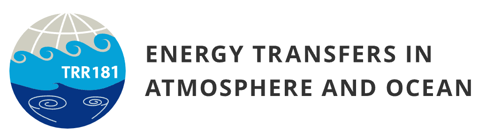
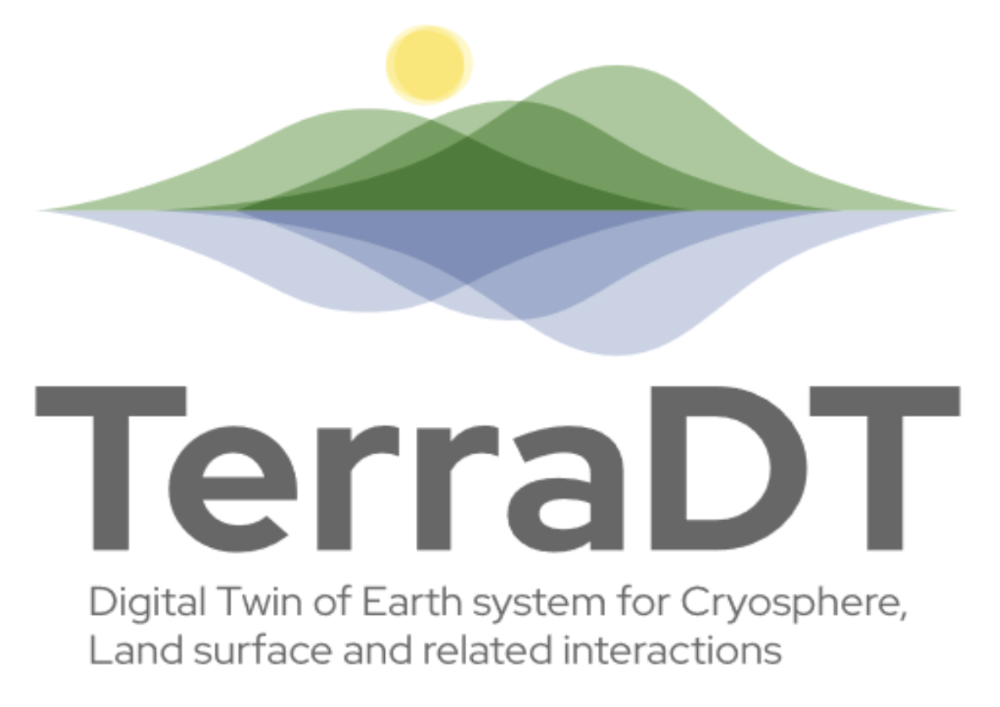
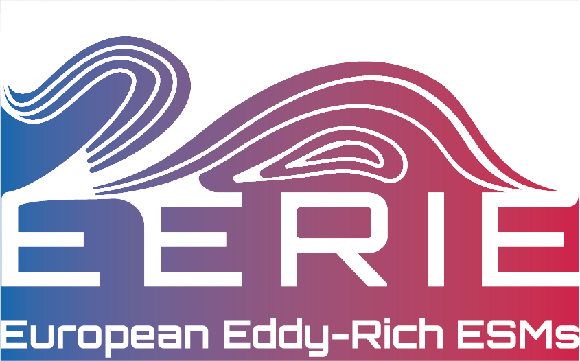
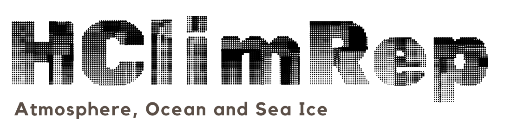
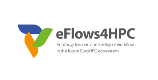

## Third party

    
    
<strong><a href="https://www.trr-energytransfers.de/">TRR181</a></strong>: In this project, we aim to understand how energy is transferred between waves, eddies, and local turbulence in the ocean and atmosphere. I am part of the S1 project, “Diagnosis and Metrics in Climate Models.”

    
    
<strong><a href="https://destination-earth.eu/">Destination Earth, Climate Digital Twin</a></strong>: In this project, we are developing infrastructure to regularly perform kilometer-scale climate projections using coupled climate models. AWI contributes with a 5 km resolution IFS-FESOM setup. I lead Activity 6 (Simulations), co-lead Activity 5 (Climate Model Development) and Activity 11 (Demonstrators), and supervise AWI’s work in Activity 14 (Artificial Intelligence & Maestro Development).

    
    
<strong><a href="https://www.terradt.eu/">TerraDT</a></strong>: In this project, we aim to enhance the DestinE infrastructure by adding to and improving the existing Earth system components of DestinE Digital Twins, with a particular focus on the cryosphere and land surface. This will improve the reliability of the climate projections and impact assessments of DestinE. I lead Pillar 5 (Cryosphere, WP11-13) and serve as a member of the TerraDT Project Management Board.

    
    
<strong><a href="https://eerie-project.eu/">EERIE</a></strong>: In this project, we are developing coupled models with a 10 km resolution in both the atmosphere and ocean, enabling century-long simulations. The goal is to investigate how resolving ocean mesoscale processes impacts the global climate, both in the present and the future. I am a member of the EERIE Steering Committee and co-lead WP11 (Development of efficient and portable workflows and diagnostics for ER-ESMs).

    
    
<strong><a href="">ELPHE</a></strong>: Enabling Lagrangian Particle Tracking for High-Resolution and Unstructured Meshes: In this project, led by GEOMAR, we aim to adapt <a href="https://oceanparcels.org/">Parcels</a> - a Lagrangian Ocean Analysis toolbox - to work with data from unstructured mesh ocean models FESOM2 and ICON-O. This is part of the <a href="https://www.warmworld.de/">WarmWorld</a> project. I provide FESOM2 simulations.

## Internal funding

    
    
<strong><a href="https://helmholtz.software/software/awi-gpt">AWI LLMs</a></strong>: I lead the activity in the development of four tools that use LLMs to enhance research and operations. <strong>pangaeaGPT</strong> aids dataset exploration, <strong><a href="https://destination-earth.eu/">ClimSight</a></strong> provides location-specific climate insights, <strong>AWI_chatbot</strong> streamlines internal tasks at AWI, and <strong>CMIP6 search</strong> improves access to CMIP6 data. The activity is funded by <a href="https://earth-data.de/">DataHub</a> and <a href="https://destination-earth.eu/">DestinE ClimateDT</a>.
    

    
    
<strong><a href="https://helmholtz.software/software/awi-gpt">HClimRep</a></strong>: In this project we build first AI foundation models for climate research that combines data from the atmosphere, the ocean and sea ice. AWIs part is to develop ocean component of this model. I contribute ocean model data and climate expertise.
    

## Finished projects

    
    
<strong><a href="https://nextgems-h2020.eu/">nextGEMS</a></strong>: In this project, we are developing next generation (storm-resolving) Earth-system Models, capable of running at 2.5 km resolution. By achieving unprecedented realism in simulations, these models will enable us to understand and reliably quantify future climate changes on both global and regional scales, as well as predict future weather patterns, including extreme events. I contribute to ocean spinups using FESOM and to the development of methods for efficient data analysis and visualization of very high-resolution data.

    

    
    
<strong><a href="https://eflows4hpc.eu/">eFlows4HPC</a></strong>: aims to deliver a workflow software stack and an additional set of services to enable the integration of HPC simulations and modelling with big data analytics and machine learning in scientific and industrial applications. I lead AWI’s contributions in WP5 (Pillar 2).

